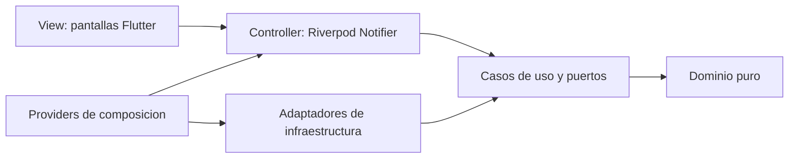
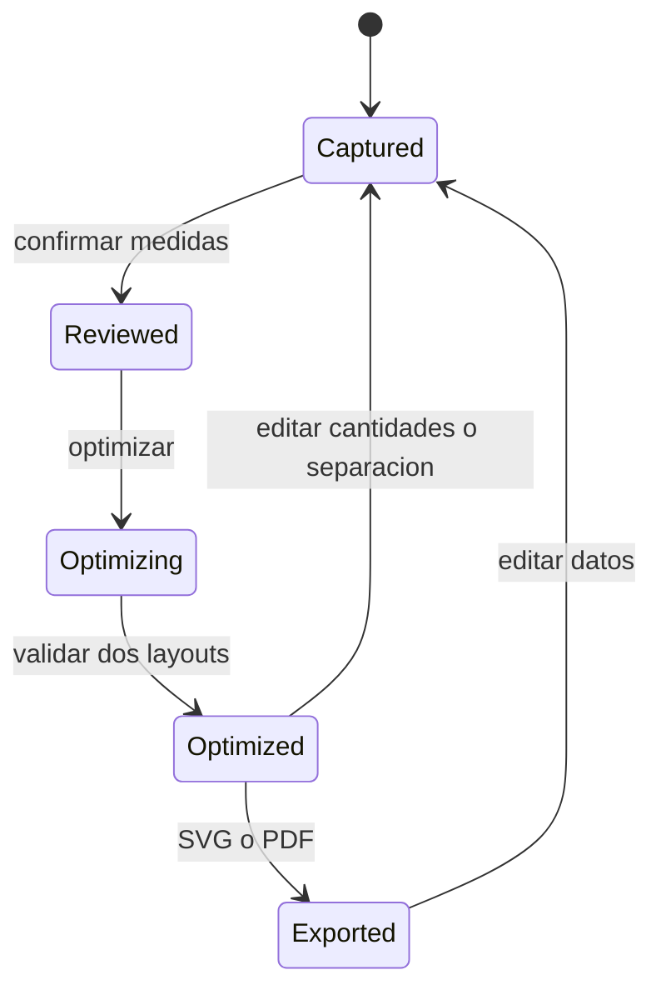

# Arquitectura de CutZero

## Objetivo

Separar reglas de corte, coordinacion, plugins y presentacion para que el solver,
la persistencia o el modelo local puedan cambiar sin reescribir toda la app. La
organizacion es Clean Architecture por funcionalidad y MVC en presentacion.

## Capas

### Dominio

No importa Flutter, SQLite ni Gemma. Define geometria, materiales, trabajos,
retales, layouts e invariantes. Los objetos son inmutables y validan cantidades,
dimensiones, rotaciones y separacion al construirse.

### Aplicacion

Contiene `RunOptimization`, `CreateRemnant`, `AgentCoordinator` y puertos para
repositorios, vision, captura, nesting y exportacion. La coordinacion trabaja
contra interfaces para cumplir inversion de dependencias.

### Infraestructura

- Drift implementa repositorios SQLite.
- Clipper2 resuelve intersecciones e inflado por separacion.
- `DeterministicNestingSolver` genera alternativas reproducibles.
- `ImagePickerAdapter` aisla camara y galeria.
- `FileLayoutExporter` genera SVG y PDF.
- flutter_gemma y LiteRT-LM ejecutan Gemma 4 en el dispositivo.

### Presentacion MVC

- Model: entidades del dominio y `CuttingWorkspaceState` inmutable.
- View: `WorkspaceScreen`, `InventoryScreen` y `AgentScreen`.
- Controller: `CuttingWorkspaceController`.

Las vistas no abren bases de datos ni ejecutan el solver. El controlador no
conoce `ImagePicker`: recibe `ImageAcquisitionPort`. Riverpod crea y enlaza las
implementaciones en `lib/app/providers.dart`.

## Principios SOLID

- Responsabilidad unica: solver, validador, exportador y repositorios separados.
- Abierto/cerrado: nuevos objetivos o adaptadores implementan puertos existentes.
- Sustitucion: fixtures y adaptadores reales cumplen los mismos contratos.
- Segregacion: contratos pequenos para captura, vision, repositorios y salida.
- Inversion: controlador y agente dependen de interfaces de aplicacion.

## Flujo principal

Una edicion invalida layouts y exportaciones previas. El solver solo publica un
resultado si el validador confirma todas las piezas, limites, defectos y gaps.

## Agente seguro

Gemma propone llamadas estructuradas, pero `AgentToolRegistry` aplica lista
blanca, valida argumentos y limita la ejecucion a diez turnos. Las herramientas
usan los mismos casos de uso deterministas que la interfaz manual. El modelo no
puede escribir archivos arbitrarios, ejecutar comandos ni modificar SQLite de
forma directa.
